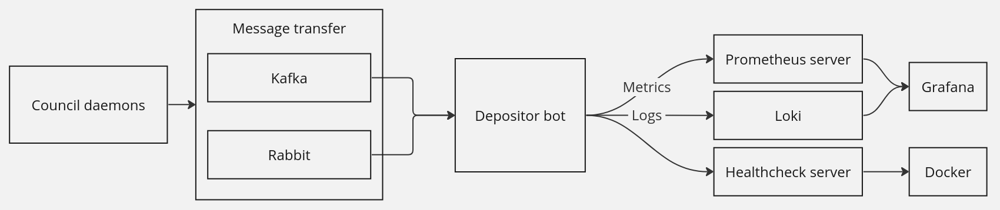
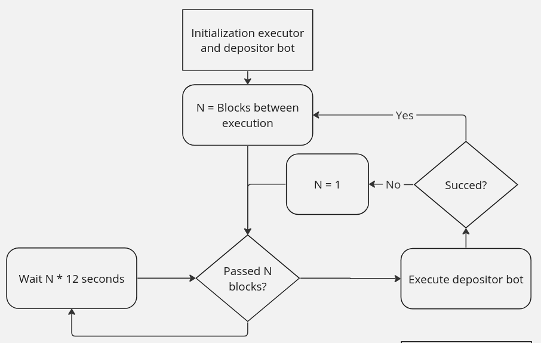
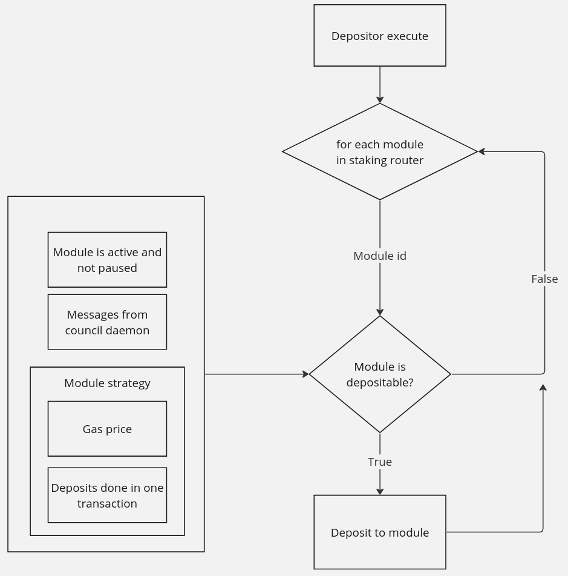
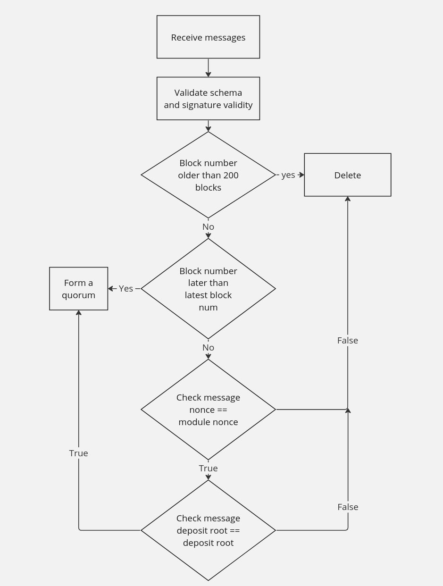

#  Lido Depositor bot

## Description

Depositor and pauser bots are parts of [Deposit Security Module](https://github.com/lidofinance/lido-improvement-proposals/blob/develop/LIPS/lip-5.md#mitigations-for-deposit-front-running-vulnerability).

**The Depositor Bot** obtains signed deposit messages from Council Daemons. 
Once a sufficient number of messages is collected to constitute a quorum, the bot proceeds to initiate a deposit into the designated staking module. 
This deposit is executed using the depositBufferedEther function within the "DepositSecurityModule" smart contract.

**The Pauser Bot** obtains pause message from Council Daemon and enacts pause on the specified staking module.

## Table of Contents

- [Running Daemon](#running-daemon)
- [Variables](#variables)
  - [Required variables](#required-variables)
  - [Additional variables](#additional-variables)
- [Metrics and logs](#metrics-and-logs)
- [Development](#development)
  - [Install](#install)
  - [Tests](#tests)
  - [Release flow](#release-flow)
- [Annotations to code](#annotations-to-code)

## Running Daemon

1. Create `.env` file 
2. Setup variables
   - Set WEB3_RPC_ENDPOINTS
   - Set WALLET_PRIVATE_KEY
   - Set CREATE_TRANSACTIONS to true
   - Set TRANSPORTS to rabbit
   - Set RABBIT_MQ_URL, RABBIT_MQ_USERNAME and RABBIT_MQ_PASSWORD
3. ```docker-compose up```
4. Send metrics and logs to grafana
5. Setup alerts

## Variables

### Required variables

| Variable                                | Default                                    | Description                                                                                                              |
|-----------------------------------------|--------------------------------------------|--------------------------------------------------------------------------------------------------------------------------|
| WEB3_RPC_ENDPOINTS                      | -                                          | List of rpc endpoints that will be used to send requests comma separated (`,`)                                           |
| WALLET_PRIVATE_KEY                      | -                                          | Account private key                                                                                                      |
| CREATE_TRANSACTIONS                     | false                                      | If true then tx will be send to blockchain                                                                               |
| LIDO_LOCATOR                            | 0xC1d0b3DE6792Bf6b4b37EccdcC24e45978Cfd2Eb | Lido Locator address. Mainnet by default. Other networks could be found [here](https://docs.lido.fi/deployed-contracts/) |
| DEPOSIT_CONTRACT                        | 0x00000000219ab540356cBB839Cbe05303d7705Fa | Ethereum deposit contract address                                                                                        |
| --------------------------------------  | --------------------------------------	    | -----------------------------------------                                                                                |
| TRANSPORTS                              | -                                          | Transports used in bot. One of/or both: rabbit/kafka                                                                     |
| RABBIT_MQ_URL                           | -                                          | RabbitMQ url                                                                                                             |
| RABBIT_MQ_USERNAME                      | -                                          | RabbitMQ username for virtualhost                                                                                        |
| RABBIT_MQ_PASSWORD                      | -                                          | RabbitMQ password for virtualhost                                                                                        |
| --------------------------------------  | --- _kafka is not used at the moment_ ---  | -----------------------------------------                                                                                |
| KAFKA_BROKER_ADDRESS_1                  | -                                          | Kafka servers url and port                                                                                               |
| KAFKA_USERNAME                          | -                                          | Kafka username                                                                                                           |
| KAFKA_PASSWORD                          | -                                          | Password for kafka                                                                                                       |
| KAFKA_NETWORK                           | -                                          | Network type (mainnet or goerli)                                                                                         |
| KAFKA_TOPIC                             | -                                          | Kafka topic name (for msg receiving)                                                                                     |
| KAFKA_GROUP_PREFIX                      | -                                          | Just for staging (staging-)                                                                                              |

### Additional variables

| Variable                          | Default    | Description                                                                                                              |
|-----------------------------------|------------|--------------------------------------------------------------------------------------------------------------------------|
| MIN_PRIORITY_FEE                  | 50 mwei    | Min priority fee that will be used in tx                                                                                 |
| MAX_PRIORITY_FEE                  | 10 gwei    | Max priority fee that will be used in tx                                                                                 |
| MAX_GAS_FEE                       | 100 gwei   | Bot will wait for a lower price. Treshold for gas_fee                                                                    |
| CONTRACT_GAS_LIMIT                | 15000000   | Default transaction gas limit                                                                                            |
| FLASHBOTS_RPC                     | -          | Flashbots rpc endpoint                                                                                                   |
| FLASHBOT_SIGNATURE                | -          | Private key - Used to identify account in flashbot`s rpc (should NOT be equal to WALLET private key)                     |
| GAS_FEE_PERCENTILE_1              | 20         | Percentile for first recommended fee calculation                                                                         |
| GAS_FEE_PERCENTILE_DAYS_HISTORY_1 | 1          | Percentile for first recommended calculates from N days of the fee history                                               |
| GAS_PRIORITY_FEE_PERCENTILE       | 25         | Priority transaction will be N percentile from priority fees in last block (min MIN_PRIORITY_FEE - max MAX_PRIORITY_FEE) |
| MAX_BUFFERED_ETHERS               | 5000 ether | Maximum amount of ETH in the buffer, after which the bot deposits at any gas                                             |
| PROMETHEUS_PORT                   | 9000       | Port with metrics server                                                                                                 |
| PULSE_SERVER_PORT                 | 9010       | Port with bot`s status server                                                                                            |
| MAX_CYCLE_LIFETIME_IN_SECONDS     | 1200       | Max lifetime of usual cycle. If cycle will not end in this time, bot will crush                                          |

## Metrics and logs

Metrics list could be found in [source code](src/metrics/metrics.py).
Prometheus server hosted on `http://localhost:${{PROMETHEUS_PORT}}/`.

## Development

### Install

```bash
git clone git@github.com:lidofinance/depositor-bot.git
cd depositor-bot
poetry install
```

To run bot

```bash
# For depositor bot
poetry run python src/depositor.py

# For pause bot
poetry run python src/pauser.py
```

### Tests

#### Run unit tests

```bash
poetry run pytest tests -m unit
```

#### Run integration tests.

Install Hardhat and run goerli fork
```bash
npm install --save-dev hardhat
npx hardhat node --fork ${{ WEB3_RPC_ENDPOINT }} &
```

```bash
poetry run pytest tests -m integration
```

### Release flow

To create a new release:

1. Merge all changes to the `main` branch.
1. After the merge, the `Prepare release draft` action will run automatically. When the action is complete, a release draft is created.
1. When you need to release, go to Repo → Releases.
1. Publish the desired release draft manually by clicking the edit button - this release is now the `Latest Published`.
1. After publication, the action to create a release bump will be triggered automatically.

## Annotations to code

Council daemons sends messages to depositor and pauser bot throw kafka or rabbit.



Every 5 blocks Executor instance calls depositor bot. If Depositor returns failed status, executor executes depositor with next block instead of waiting for 5 blocks. 



Depositor bot makes deposit only if next conditions are ok
- Gas fee is low enough
- There are enough buffered eth ready for deposit
- There are enough messages from Council Daemons to form a quorum
- Module is active and not paused



Message filtering process
1. Filter all invalid messages. (Invalid schema or signature)
2. Filter all expired messages
3. Filter all messages with block number less or equal to latest block in depositor bot and with outdated nonce or deposit root.


